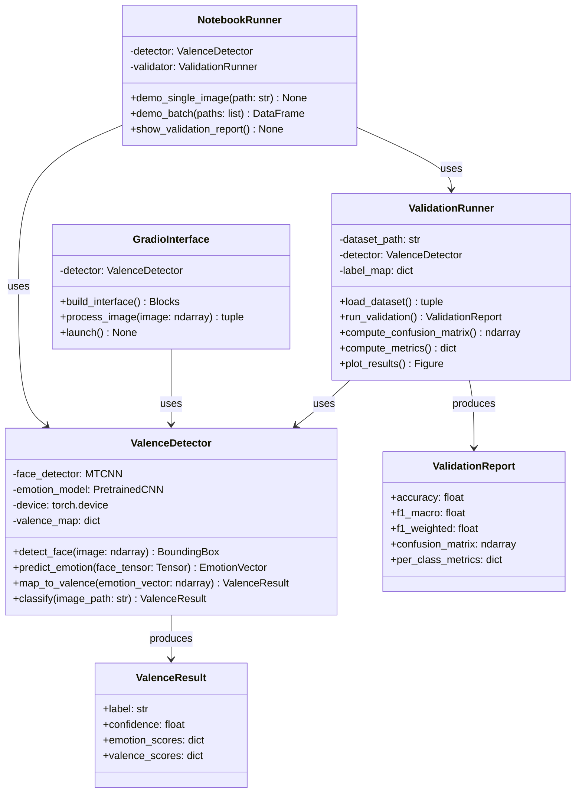

# Concept Note: Facial Valence Detection System

## 1. Problem Statement

### Context and Motivation

The marketing department has requested a tool that can detect the emotional state of a person while
watching the company's advertisements. The goal is to measure viewer reactions to ad content by analyzing
facial expressions captured in still images. Rather than classifying granular emotions (anger, fear, joy, etc.),
we adopt a **threefold valence categorization** — **negative**, **neutral**, and **positive** — which
provides a cleaner, more actionable signal for marketing analytics. We use the term **valence** throughout
this document instead of "emotion" to reflect this simplified, polarity-based framing.

### Scope

The system receives an image containing a human face and returns:

- A **valence label** (negative / neutral / positive)
- A **confidence score** for the prediction
- The underlying **emotion probability distribution** (7-class) from which the valence was derived

The system must also provide a **validation framework** to assess the quality of its own classification
results against labeled benchmark data.

---

## 2. Overall Goal

### 2.1 Aim of the Work

Build a production-ready valence detection pipeline that:

1. Detects and localizes a face in an input image
2. Classifies the facial expression into one of seven standard emotions
3. Maps those emotions onto the three-class valence scale
4. Reports the result with a confidence metric
5. Validates classification quality on benchmark data with standard ML metrics

### 2.2 Main Ideas

- **Pretrained model packaging**: We leverage a state-of-the-art pretrained facial expression recognition
  model rather than training from scratch. This reduces development time and leverages models trained on
  datasets far larger than what we could assemble independently.
- **Valence as aggregation**: The standard 7-class emotion taxonomy (angry, disgust, fear, happy, neutral,
  sad, surprise) is mapped to three valence classes. This mapping is a deliberate design choice — the
  marketing department does not need fine-grained emotion labels; they need a polarity signal.
- **Decoupled pipeline**: Face detection, emotion classification, and valence mapping are separate stages.
  This allows each component to be tested, replaced, or upgraded independently.
- **Built-in validation**: The system includes a dedicated validation module that runs the pipeline on
  benchmark data and computes quality metrics — not as an afterthought, but as a core component.

### 2.3 Valence Mapping

| Emotion    | Valence    | Rationale                                                     |
|------------|------------|-------------------------------------------------------------- |
| angry      | Negative   | Clear negative affect                                         |
| disgust    | Negative   | Clear negative affect                                         |
| fear       | Negative   | Clear negative affect                                         |
| sad        | Negative   | Clear negative affect                                         |
| neutral    | Neutral    | No dominant affect                                            |
| happy      | Positive   | Clear positive affect                                         |
| surprise   | Positive   | In the context of advertisement viewing, surprise is positive |

### 2.4 Positives

- **Fast development**: Pretrained models eliminate weeks of training and data collection
- **High baseline accuracy**: State-of-the-art FER models achieve ~70-75% accuracy on 7-class FER2013;
  aggregation to 3 classes further boosts effective accuracy
- **GPU-accelerated inference**: Available NVIDIA RTX 5070 Ti enables real-time processing
- **Interpretable output**: Confidence scores and the full emotion distribution provide transparency
- **Notebook-presentable**: The pipeline is designed so the core flow can be walked through cell-by-cell
  in a Jupyter notebook, which is valuable for stakeholder demonstrations

### 2.5 Negatives and Limitations

- **FER2013 label noise**: The standard benchmark has ~65% human inter-annotator agreement, meaning the
  ceiling for model accuracy is inherently limited by label quality
- **Surprise ambiguity**: Mapping "surprise" to positive is context-dependent; in non-advertising contexts,
  surprise may be negative (this mapping is fixed to our use case)
- **Single-image limitation**: The system classifies one frame at a time. Temporal dynamics (how valence
  changes over the course of an advertisement) require separate orchestration
- **Pose and occlusion sensitivity**: Pretrained models perform best on frontal, well-lit faces. Partial
  occlusion or extreme angles degrade accuracy
- **Blackwell GPU constraint**: The RTX 5070 Ti (compute capability 12.0) requires nightly PyTorch builds,
  which are less stable than release versions

---

## 3. Timeline and Risks

### 3.1 Project Plan

| Phase | Task                            | Duration | Dependencies          |
|-------|---------------------------------|----------|-----------------------|
| 1     | Obtain data (FER2013 / Kaggle)  | 1 day    | Kaggle account        |
| 2     | Explore and preprocess data     | 2 days   | Phase 1               |
| 3     | Set up GPU environment          | 1 day    | GPU drivers, uv       |
| 4     | Integrate pretrained model      | 3 days   | Phases 2, 3           |
| 5     | Build valence mapping layer     | 1 day    | Phase 4               |
| 6     | Implement validation module     | 2 days   | Phase 5               |
| 7     | Build Gradio web interface      | 2 days   | Phase 5               |
| 8     | Create Jupyter notebook         | 2 days   | Phases 5, 6           |
| 9     | Testing and documentation       | 2 days   | All phases            |
|       | **Total**                       | **~16 days** |                   |

### 3.2 Risk Register

| Task                    | Duration | Low Risk              | Medium Risk                  | High Risk                    | Impact  |
|-------------------------|----------|-----------------------|------------------------------|------------------------------|---------|
| Obtain data             | 1 day    | Kaggle (freely available) |                           |                              | 1 day   |
| Explore data            | 2 days   |                       | Data quality / label noise   |                              | 3 days  |
| Set up GPU environment  | 1 day    |                       |                              | Blackwell nightly build issues | 3 days  |
| Integrate model         | 3 days   | HuggingFace ecosystem |                              |                              | 2 days  |
| Build valence mapping   | 1 day    | Straightforward logic |                              |                              | 1 day   |
| Implement validation    | 2 days   |                       | Ambiguous ground truth       |                              | 2 days  |
| Build interface         | 2 days   | Gradio is mature      |                              |                              | 1 day   |
| Develop model           | 10 days  |                       |                              | Unexpected results           | 5 days  |

**Key risk mitigation**: If the native Windows + NTFS setup produces issues with PyTorch nightly on the
Blackwell GPU, we have a validated WSL2 fallback path (Ubuntu mount at `\\wsl.localhost\Ubuntu\home\blai\`)
that has been used successfully in the VLC data engineering project. The tcnvsrnn project has already
confirmed that PyTorch nightly with CUDA 12.8 works natively on this GPU on Windows, so the WSL path is a
contingency, not the primary plan.

---

## 4. Methodology

### 4.1 System Architecture — UML Class Diagram

### 4.2 Process Flow — UML Activity Diagram

### 4.3 Classification Process

The classification pipeline operates in four sequential stages:

1. **Face detection**: MTCNN (Multi-task Cascaded Convolutional Network) scans the input image and returns
   bounding box coordinates, facial landmarks, and a detection confidence score. If no face is detected,
   the pipeline returns an error immediately.

2. **Preprocessing**: The detected face region is cropped, aligned using landmark positions (eye centers),
   resized to the model's expected input dimensions (typically 224×224 pixels), and normalized to the
   value range expected by the pretrained backbone (ImageNet normalization).

3. **Emotion inference**: The preprocessed face tensor is passed through the pretrained CNN. The final layer
   outputs a 7-dimensional softmax vector representing probabilities for each emotion class: angry,
   disgust, fear, happy, neutral, sad, surprise.

4. **Valence mapping**: The 7-class probabilities are aggregated into 3 valence scores:
   - `P(negative) = P(angry) + P(disgust) + P(fear) + P(sad)`
   - `P(neutral) = P(neutral)`
   - `P(positive) = P(happy) + P(surprise)`

   The highest-scoring valence class becomes the label; its score becomes the confidence.

**Why this structure**: Separating detection from classification allows us to swap the emotion model without
changing the face detector (or vice versa). The explicit valence mapping layer is transparent and auditable —
the marketing department can see exactly how emotions map to their valence categories, and the mapping can
be adjusted if the business definition of "positive" or "negative" changes.

### 4.4 Validation Process

Validation is a first-class component, not an afterthought. The system must demonstrate that its
classifications are meaningfully better than random chance and that failure modes are understood.

**Dataset**: FER2013 (Facial Expression Recognition 2013), freely available on Kaggle. It contains ~35,887
grayscale 48×48 images labeled with 7 emotion classes, split into training (~28k), validation (~3.5k),
and test (~3.5k) sets. We use the **test split only** for validation — the model is pretrained and not
fine-tuned on FER2013, so train/test leakage is not a concern.

**Ground truth transformation**: FER2013 labels are mapped to 3-class valence using the same mapping table
defined in Section 2.3.

**Metrics**:

- **Confusion matrix** (3×3): Shows exactly where the model confuses valence categories
- **Per-class precision and recall**: Identifies whether the model has bias toward specific classes
- **F1-score** (macro-averaged): Balances precision and recall across classes equally, regardless of class
  frequency
- **F1-score** (weighted): Accounts for class imbalance in FER2013
- **Overall accuracy**: Percentage of correct predictions

**Baselines for comparison**:

- **Random baseline**: 33.3% accuracy (uniform random among 3 classes)
- **Majority class baseline**: Accuracy of always predicting the most frequent class

**Qualitative analysis**: A sample of misclassified images is visualized to understand systematic failure
modes (e.g., does the model consistently misclassify subtle smiles as neutral?).

**Why this approach**: Quantitative metrics alone can be misleading. The confusion matrix reveals structural
biases (e.g., the model may rarely predict "negative" if the pretrained model was trained on a
positivity-skewed dataset). Qualitative review of errors provides actionable insight for potential model
improvements. Comparing against baselines ensures the model provides genuine predictive value.

### 4.5 Framework and Tool Selection

| Component              | Tool / Framework              | Rationale                                                         |
|------------------------|-------------------------------|-------------------------------------------------------------------|
| **Language**           | Python 3.12                   | Required for PyTorch nightly compatibility with Blackwell GPU     |
| **Package management** | uv                            | Fast, reproducible dependency resolution with custom index support |
| **Deep learning**      | PyTorch (nightly + CUDA 12.8) | Best ecosystem support for vision models; nightly required for sm_120 |
| **Face detection**     | facenet-pytorch (MTCNN)       | Lightweight, well-tested, PyTorch-native face detector            |
| **Emotion model**      | HuggingFace transformers / timm | Access to pretrained ViT and EfficientNet models fine-tuned for FER |
| **Image processing**   | Pillow, torchvision           | Standard image I/O and tensor transforms                          |
| **Validation metrics** | scikit-learn                  | Comprehensive classification metrics (confusion_matrix, classification_report) |
| **Visualization**      | matplotlib, seaborn           | Confusion matrix heatmaps, sample image grids, metric plots       |
| **Web interface**      | Gradio                        | Rapid prototyping; clean UI with image upload; embeddable in notebooks |
| **Notebook**           | JupyterLab                    | Interactive presentation of the full pipeline for stakeholders    |
| **Version control**    | git + GitHub                  | Standard VCS with CI/CD capability via GitHub Actions             |
| **Testing**            | pytest                        | Unit tests for mapping logic, integration tests for pipeline      |

**Key decisions explained**:

- **PyTorch over TensorFlow**: The available GPU (RTX 5070 Ti, Blackwell sm_120) is only supported by
  PyTorch nightly builds. TensorFlow does not yet support this compute capability in any release channel.
  Additionally, the ACIDVUCA ecosystem has validated PyTorch nightly + CUDA 12.8 on this exact hardware.

- **MTCNN over YOLO/RetinaFace for face detection**: MTCNN provides facial landmarks (needed for alignment)
  alongside bounding boxes, is lightweight enough for single-image inference, and is available as a
  PyTorch-native implementation via `facenet-pytorch`. YOLO-based face detectors are faster for batch/video
  but add unnecessary complexity for our single-image use case.

- **Gradio over Streamlit/Flask**: Since the core task is packaging a pretrained model, the interface
  quality matters. Gradio provides a polished image-upload UI out of the box, supports real-time inference
  callbacks, and can be launched from within a Jupyter notebook cell — making it ideal for demos to the
  marketing department. Flask would require building a frontend from scratch; Streamlit is viable but less
  focused on ML inference demos.

- **HuggingFace ecosystem for the model**: HuggingFace Hub hosts multiple pretrained facial emotion
  recognition models (e.g., ViT-based, EfficientNet-based) that can be loaded with two lines of code.
  This dramatically reduces integration effort and provides access to community-validated checkpoints.

### 4.6 Development Environment

**Primary setup (native Windows)**:

- OS: Windows 11, NTFS filesystem
- Shell: PowerShell 7.5 (pwsh)
- GPU: NVIDIA GeForce RTX 5070 Ti Laptop GPU
  - Architecture: Blackwell (compute capability 12.0)
  - CUDA runtime: 12.8
  - Validated: 2048×2048 GEMM in 73.56ms
- Python: 3.12.11 via uv
- PyTorch: nightly build with CUDA 12.8 index (`https://download.pytorch.org/whl/nightly/cu128`)
- uv configuration requires `prerelease = "allow"` and `index-strategy = "unsafe-best-match"`

**Fallback (WSL2)**:

If native Windows encounters issues with specific PyTorch operations or CUDA interop, a WSL2 Ubuntu
environment is available and accessible at `\\wsl.localhost\Ubuntu\home\blai\`. This path has been used
successfully for the VLC project (Docker + Kafka + TimescaleDB stack). The WSL fallback involves:

1. Mounting the project directory or cloning into the WSL filesystem
2. Installing CUDA toolkit within WSL (the GPU driver is shared with Windows)
3. Running the same uv-based setup inside Ubuntu

**Jupyter notebook strategy**: The main inference pipeline is designed so that each stage (face detection →
preprocessing → inference → valence mapping) can be demonstrated in a separate notebook cell with visual
output. The validation module produces inline plots (confusion matrix, sample predictions). Gradio's
`launch(inline=True)` embeds the full interactive interface inside a notebook cell for live demos.

### 4.7 Data

**FER2013** (Facial Expression Recognition 2013):

- Source: Kaggle (freely downloadable)
- Size: 35,887 grayscale images at 48×48 pixels
- Labels: 7 emotion categories (angry, disgust, fear, happy, neutral, sad, surprise)
- Split: ~28k training / ~3.5k validation / ~3.5k test
- Format: CSV with pixel arrays (or extracted image folders)
- Known issues: Noisy labels (~65% inter-annotator agreement), low resolution, some non-face images

**For our pipeline**: we use FER-2013's test split for validation. The pretrained model that ships in the
final implementation is `trpakov/vit-face-expression`, which is itself fine-tuned on FER-2013's training
split — so this is an **in-distribution evaluation**: it measures the deployed pipeline's faithfulness to
the labels the model was trained against, not its generalisation to a held-out distribution. The headline
metrics in the validation report (Accuracy 82.86 %, F1 macro 0.803, MCC 0.728) should be read in that
light. A future out-of-distribution assessment on AffectNet — which carries continuous valence-arousal
annotations directly aligned with our framing — is listed as a candidate enhancement (cf. README *Future
work* §1).

If higher-resolution validation is desired, **AffectNet** (available via academic license) provides ~420k
images with both categorical emotion labels and continuous valence-arousal annotations — directly aligning
with our valence-based framing. This is a future enhancement option.

### 4.8 Implementation notes (post-P1)

This concept note was authored at P1 (project planning). The shipped implementation made a small number
of pragmatic simplifications and additions, captured here so the document remains an accurate guide to
the final state of the repository.

**Architectural simplifications relative to the §4.1 class diagram**:

- The Gradio web UI is implemented as **module-level functions** in `src/ratemyhuman/app.py` (`predict()`,
  `build_app()`, `launch()`, plus private helpers `_get_detector()`, `_reset()`, `_format_status_card()`,
  `_format_result_card()`) rather than a `GradioInterface` class. The lazy-singleton `_detector` plays the
  role the class would have.
- The notebook deliverable is the freestanding `docs/presentation.ipynb`; there is no `NotebookRunner` class.
- `ValenceDetector.detect_face()` returns the **cropped face directly** (`np.ndarray | None`) rather than a
  separate `BoundingBox` followed by a crop step — the two stages are fused inside the MTCNN call.
- `ValenceDetector.predict_emotion()` returns a plain `np.ndarray` of 7 probabilities rather than a bespoke
  `EmotionVector` type.
- The emotion model in §4.1 is typed as `PretrainedCNN`; the model that shipped is a Vision Transformer
  (`ViTForImageClassification`).
- `ValidationRunner.compute_confusion_matrix()` and `plot_results()` from the diagram are realised as
  `compute_metrics()` (returns the full `ValidationReport` including the confusion matrix) plus two specific
  plot methods, `plot_confusion_matrix()` and `plot_misclassified()`.

**Additions to `ValidationReport`**:

The report ships with five extra fields beyond the §4.1 diagram: `mcc`, `total_images`, `skipped_images`,
`baseline_random`, `baseline_majority`, and a `misclassified` slice that feeds the qualitative-analysis plot.

**Additions to the metrics suite (relative to §4.4)**:

The Matthews Correlation Coefficient (MCC) is computed alongside accuracy and F1; it is more robust on
imbalanced sets than accuracy alone. The validation runner also tracks the **MTCNN no-face skip rate**
(~16 % of FER-2013's 48×48 thumbnails — 590 of 3,589) which §4.4 did not anticipate.

**Additions to the surface area (not in §4 deliverables)**:

- `ValenceDetector.classify_array(image: np.ndarray | Image.Image)` for in-memory inputs (used by the
  Gradio UI and the unit tests).
- `--device cpu` flag on `classify` and `validate`, plus auto-detection in `demo`, so the pipeline runs
  without a GPU at reduced speed.
- `uv run ratemyhuman explore` — promoted from a one-off planning phase (§3.1) to a permanent CLI verb
  that produces `class_distribution.png`, `valence_distribution.png`, and per-emotion sample grids under
  `docs/`.
- `uv run ratemyhuman push` — DVC + git + pre-commit + dual-push automation for the maintainer workflow.
- **DVC + S3 dataset management** — the FER-2013 dataset is now tracked via DVC pointer files alongside a
  Kaggle download fallback (cf. README *Installation* Step 6). §4.7 was authored before this was decided.

**Minor terminology drift**:

§4.5 mentions `timm` as a candidate library; the final dependency tree uses `transformers` only. §4.6's
"JupyterLab" entry is satisfied by `docs/presentation.ipynb` running under any Jupyter frontend; no
JupyterLab-specific dependency is pinned.

**Items unchanged from P1**:

The §4.3 classification flow (detect → preprocess → infer → map) and the §2.3 valence mapping table are
bit-for-bit identical to the implementation in `model.py`. The framework choices in §4.5 (Python 3.12, uv,
PyTorch nightly + CUDA 12.8, facenet-pytorch, HuggingFace transformers, scikit-learn, matplotlib + seaborn,
Gradio, pytest) and the dev environment in §4.6 (Windows 11 + RTX 5070 Ti, Blackwell sm_120) match the
lockfile and the README.

---

## 5. Summary

This concept describes a facial valence detection system built around a pretrained emotion recognition model,
with a clear pipeline architecture (detection → classification → valence mapping), a rigorous validation
framework (FER2013 benchmark with standard metrics), and a dual-interface delivery (Gradio web UI +
Jupyter notebook). The system is feasible within the available development environment (RTX 5070 Ti on
Windows with PyTorch nightly) and can be delivered in approximately 16 working days. The decoupled
architecture ensures that individual components can be improved or replaced as better models or data become
available.
